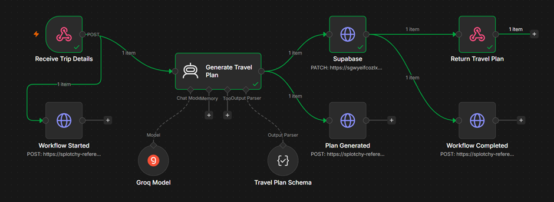
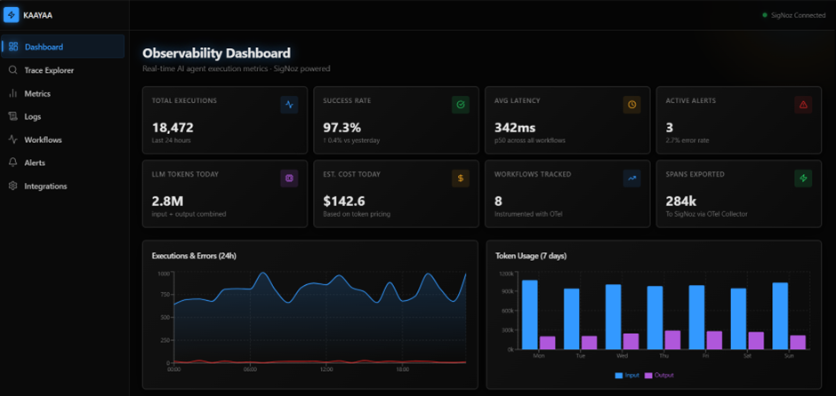
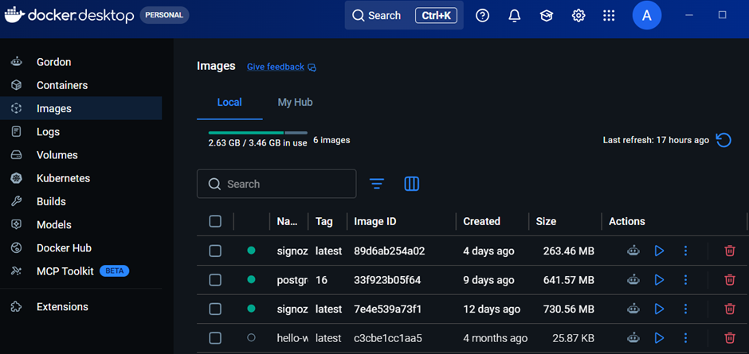
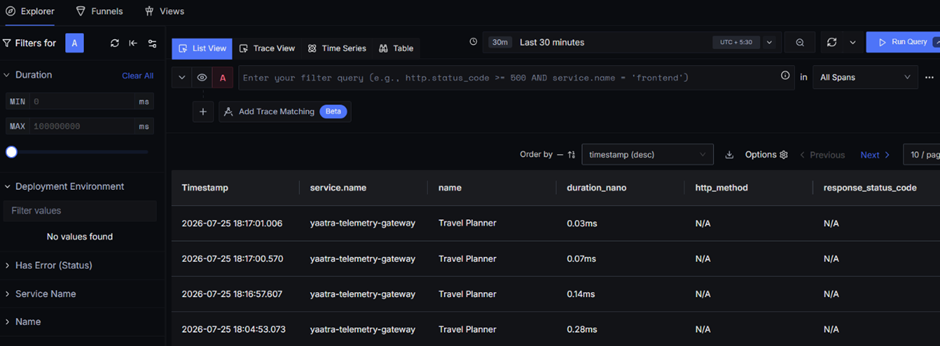

# 🚀 KAAYAA — AI & Agent Observability Platform

<div align="center">

### End-to-End Observability for AI Agents, n8n Workflows, and LLM Applications

Monitor every AI workflow execution with **OpenTelemetry**, **SigNoz**, and a modern **React + TypeScript Dashboard**.


</div>

---

# 📖 Overview

Kaayaa is a modern observability dashboard built specifically for AI-powered applications.

Instead of only monitoring servers or APIs, ObserveAI helps visualize the entire lifecycle of AI workflows including:

- 🤖 AI Agent Execution
- 🔄 n8n Workflow Monitoring
- 📊 OpenTelemetry Traces
- 📈 Metrics
- 📜 Logs
- ⚡ Performance
- ❌ Errors
- 💰 Token Usage
- 🧠 LLM Metadata

The platform integrates with **OpenTelemetry** and **SigNoz** to provide end-to-end visibility across AI systems.

---

# 🚀 Live Demo
🔗 Live Dash Demo: https://kaayaa-dashboard.vercel.app/                                              
🚧 Currently running locally / on vercel / on signoz                 
📃 Technical Blog: https://dev.to/abhi-the-great/end-to-end-observability-to-ai-application-using-opentelemetry-and-signoz-13h3

---

# 📸 Screenshots

### AI Workflow (n8n)


### Dashboard


### Docker


### Signoz Explorer


---

# ✨ Features

- Modern React Dashboard
- AI Workflow Monitoring
- Trace Explorer
- Metrics Dashboard
- Log Viewer
- Workflow Timeline
- Agent Execution Status
- AI Model Information
- Token Consumption
- Response Time Monitoring
- Error Tracking
- OpenTelemetry Integration
- SigNoz Integration
- n8n Workflow Support
- Local Development Ready
- Mock Data for UI Development
- Easily Replaceable API Layer

---

# 🏗️ Tech Stack

## Frontend

- React 19
- TypeScript
- Vite
- Tailwind CSS
- Lucide Icons
- Recharts

---

## Observability

- OpenTelemetry SDK
- OTLP Protocol
- SigNoz
- OpenTelemetry Collector

---

## AI Workflow

- n8n
- Groq

---

# 🚀 Running the Dashboard

## 1. Clone Repository

```bash
git clone https://github.com/abhi8hero/kaayaa
cd kaayaa
```

---

## 2. Install Dependencies

Using pnpm

```bash
pnpm install
```

or npm

```bash
npm install
```

---

## 3. Start Development Server

```bash
pnpm vite
```

or

```bash
npm run dev
```

Open

```
http://localhost:5173
```

---

# 📡 Complete Local Observability Setup

Kaayaa works with three major services:

- Telemetry Gateway
- SigNoz
- Dashboard

Once all are running, traces generated from n8n appear automatically inside SigNoz and can be visualized inside the dashboard.

---

## 🐧 Ubuntu (WSL2) Setup

ObserveAI uses **SigNoz Foundry**, which runs best inside **Ubuntu running on WSL2 (Windows Subsystem for Linux)**. If you're using Windows, follow the steps below to set up your development environment.

### Step 1: Install WSL

Open **PowerShell** as Administrator and run:

```powershell
wsl --install
```

Once the installation is complete, **restart your computer**.

---

### Step 2: Install Ubuntu

After restarting:

1. Open the **Microsoft Store**.
2. Search for **Ubuntu 22.04 LTS** (or the latest LTS version).
3. Install it.
4. Launch Ubuntu and complete the initial setup by creating a username and password.

---

### Step 3: Verify WSL Installation

Run the following command:

```bash
wsl --status
```

Expected output:

```text
Default Version: 2
```

If the default version is not **2**, run:

```powershell
wsl --set-default-version 2
```

---

### Step 4: Update Ubuntu

Open your Ubuntu terminal and update all packages:

```bash
sudo apt update
sudo apt upgrade -y
```

---

### Step 5: Install Required Utilities

Install the essential packages needed for development:

```bash
sudo apt install git curl unzip -y
```

You are now ready to install Docker and SigNoz Foundry.

---

# 🐳 Docker Desktop Installation

Docker Desktop is required to run the local SigNoz observability stack.

## Step 1: Download Docker Desktop

Download and install the latest version of **Docker Desktop** for Windows from the official Docker website.

Complete the installation and restart your computer if prompted.

---

## Step 2: Enable WSL2 Backend

Open **Docker Desktop** and navigate to:

```text
Settings
   ↓
General
   ↓
✅ Use the WSL 2 based engine
```

Make sure the **Use the WSL 2 based engine** option is enabled.

---

## Step 3: Enable Ubuntu Integration

Navigate to:

```text
Settings
   ↓
Resources
   ↓
WSL Integration
   ↓
Enable integration with your Ubuntu distribution
```

Enable the toggle for your installed Ubuntu distribution and click **Apply & Restart**.

---

## Step 4: Verify Docker Installation

Open your Ubuntu terminal and verify Docker:

```bash
docker --version
```

Example output:

```text
Docker version 28.x.x
```

---

## Step 5: Verify Docker Compose

Run:

```bash
docker compose version
```

Example output:

```text
Docker Compose version v2.x.x
```

If both commands execute successfully, Docker Desktop is correctly configured and ready to run SigNoz.

# 1️⃣ Start Telemetry Gateway

Open a new terminal.

Navigate to the gateway project.

```bash
cd ~/telemetry-gateway
```

Install dependencies if required.

```bash
npm install
```

Start the server.

```bash
npm run dev
```

You should see:

```text
✅ OpenTelemetry initialized

🚀 Gateway running on port 3000
```

This service receives telemetry events from n8n workflows and exports them to SigNoz.

---

# 2️⃣ Start ngrok

ngrok allows n8n Cloud or remote workflows to communicate with your local Telemetry Gateway.

## Install ngrok (First Time)

Add your authentication token.

```bash
ngrok config add-authtoken <your-ngrok-token>
```
Go to https://dashboard.ngrok.com/get-started/setup/windows after login / sign-up, you will got token.
---

Open another terminal.

Run:

```bash
ngrok http 3000
```

Example output:

```
Forwarding

https://xxxxx.ngrok-free.dev

↓

http://localhost:3000
```

Example URL:

```
https://splotchy-referee-glowworm.ngrok-free.dev
```

Copy this URL.

You'll use this endpoint inside n8n HTTP Request nodes.

---

# 3️⃣ Start SigNoz

Open another terminal.

Navigate to your SigNoz deployment.

```bash
cd ~/signoz/pours/deployment
```

Start all containers.

```bash
docker compose up -d
```

Verify all containers are running.

```bash
docker ps
```

Open SigNoz

```
http://localhost:3301
```

---


# 📦 SigNoz Components

Running the Docker Compose deployment automatically starts:

- SigNoz UI
- OpenTelemetry Collector
- ClickHouse
- Query Service
- Alert Manager
- Frontend
- Other supporting services

No additional collector installation is required.

---

# 🌐 Configure n8n

Run n8n using Docker.

```bash
docker run -it --rm \
--name n8n \
-p 5678:5678 \
-v ~/.n8n:/home/node/.n8n \
n8nio/n8n
```

Open

```
http://localhost:5678
```

Create or import your workflow.

or

you can also use n8n cloud.

---


# 📊 Dashboard Integration

The dashboard currently ships with mock telemetry data for development.

Mock data is located at:

```
src/lib/mockData.ts
```

For production or real-time observability, replace the mock data calls with your backend API.

Update these files:

```
src/pages/TraceExplorer.tsx

src/pages/MetricsView.tsx

src/pages/LogsView.tsx
```

Replace the mock imports with real API requests to your backend or directly to SigNoz APIs.

Once these three files are connected to live telemetry APIs, the dashboard runs efficiently end-to-end with real traces, metrics, and logs.

---

# ⚙️ Environment Variables (Optional)

Create

```
.env.local
```

Example

```env
VITE_SIGNOZ_ENDPOINT=http://localhost:4317

VITE_COLLECTOR_ENDPOINT=http://localhost:4318

VITE_SERVICE_NAME=kaayaa

VITE_N8N_WEBHOOK=http://localhost:5678/webhook
```

### If you use the KAAYAA dashboard then you can directly use the setting option for Environment Variables
---

# 📈 Available Dashboard Modules

- Dashboard Overview
- Workflow Health
- AI Workflow Timeline
- Trace Explorer
- Metrics
- Logs
- Agent Status
- Token Analytics
- Response Time
- Error Monitoring
- AI Provider Details

---

# 🛠 Development

Run development server

```bash
pnpm dev
```

Build project

```bash
pnpm build
```

Preview production build

```bash
pnpm preview
```

---

# 📦 Production Build

```bash
pnpm build
```

The optimized files are generated inside:

```
dist/
```

Deploy using:

- Vercel
- Netlify
- Nginx
- GitHub Pages
- Any Static Hosting

---


# 📝 Notes

- This project is local-first.
- SigNoz runs entirely on Docker.
- The dashboard includes mock telemetry data for development.
- Replace `mockData.ts` integrations with real APIs before production deployment.
- The dashboard is designed to support any OpenTelemetry-compatible backend.
- Any LLM provider can be integrated as long as telemetry is exported through OpenTelemetry.

---

# 🤝 Contributing

Contributions are welcome.

1. Fork the repository
2. Create a feature branch
3. Commit your changes
4. Push to your branch
5. Open a Pull Request

---

## 👨‍💻 Designed By
**Abhishek Ugare**

- Email: abhishekugare1289@gmail.com
- LinkedIn: https://www.linkedin.com/in/abhishek-ugare-a289s85k
- Portfolio: https://abhi8hero.github.io/portfolio-abhishek_ugare/


<div align="center">

Observe • Trace • Debug • Optimize

</div>